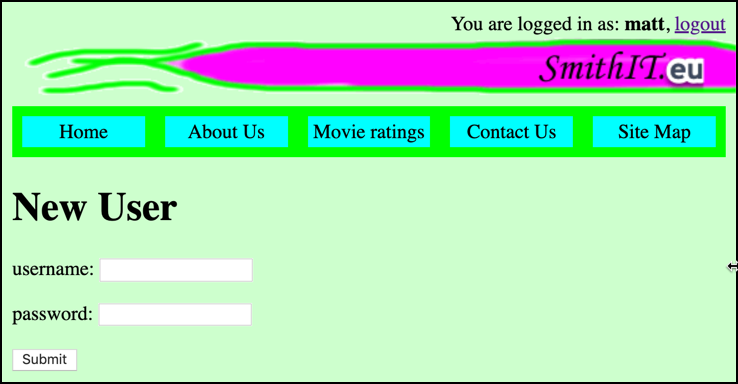
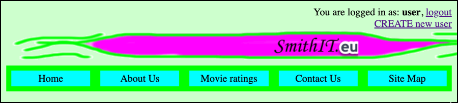

# evote-movie-2020-16-user-create

Let's add a feature whereby logged-in users can create and insert new users into the DB



- crete a new Twig template for a form to create a new Usere, `/templates/newUserForm.html.twig`:
    
    ```twig
    
    
    new user
    
    
        <h1>
            New User
        </h1>
    
        <form action="/" method="post">
            <input type="hidden" name="action" value="processNewUser">
    
            <p>
                username:
                <input name="username">
            <p>
                password:
                <input name="password">
            <p>
                <input type="submit">
        </form>
    
    
    ```

- add a new controller class `AdminController`, containing a method `newUserForm()` to display the above Twig template:

    ```php
    <?php
    namespace Tudublin;
    
    class AdminController extends Controller
    {
        public function newUserForm()
        {
            $template = 'newUserForm.html.twig';
            $args = [];
            $html = $this->twig->render($template, $args);
            print $html;
        }
    }
    ```

- add a new "route" for the form in the z`WebApplication` Front Controller, so that when the action is `newUserForm` the form will be displayed:

    ```php
    class WebApplication
    {
        public function run()
        {
            $action = filter_input(INPUT_GET, 'action');
            if(empty($action)){
                $action = filter_input(INPUT_POST, 'action');
            }
            $mainController = new MainController();
            $movieController = new MovieController();
            $loginController = new LoginController();
            $adminContoller = new AdminController();
    
            switch ($action) {
                case 'newUserForm':
                    $adminContoller->newUserForm();
                    break;
    ```
  
    - NOTE: we create a new object-instance of class `AdminController` named `$adminController` before the **switch** statement

- the action for our new user form was `processNewUser`, so we need to write an `AdminController` method to perform that action - retrieving the submitted username/password from the form, creating a new `User` object and inserting it in the database:

    ```php
    public function processNewUser()
    {
        $username = filter_input(INPUT_POST, 'username');
        $password = filter_input(INPUT_POST, 'password');

        $user = new User();
        $user->setUsername($username);
        $user->setPassword($password);

        $userRepository = new UserRepository();
        $userRepository->create($user);

        $movieController = new MovieController();
        $movieController->listMovies();
    }
    ```

- we now need to add a **LOGIN PROTECTED** route for this action in the `WebApplication` Front Controller:

    ```php
    public function run()
    {
        $action = filter_input(INPUT_GET, 'action');
        if(empty($action)){
            $action = filter_input(INPUT_POST, 'action');
        }
        $mainController = new MainController();
        $movieController = new MovieController();
        $loginController = new LoginController();
        $adminContoller = new AdminController();
    
        switch ($action) {
            case 'processNewUser':
                if($loginController->isLoggedIn()){
                    $adminContoller->processNewUser();
                } else {
                    $movieController->error('you are not authorised for this action');
                }
                break;
                
            case 'newUserForm':
                $adminContoller->newUserForm();
                break;
    ```

- Finally, in the base Twig template `/templates/_base.html.twig` let's display a link for creating new users when someone is loggd-in:

    ```php
    <div id="login">
        
            You are logged in as: <b>{{ session.username }}</b>,
            <a href="/index.php?action=logout">logout</a>
            <br>
            <a href="/index.php?action=newUserForm">CREATE new user</a>
        
            <a href="/index.php?action=login">login</a>
        
    </div>
    ```



